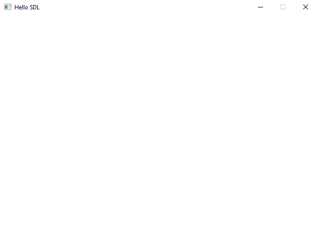
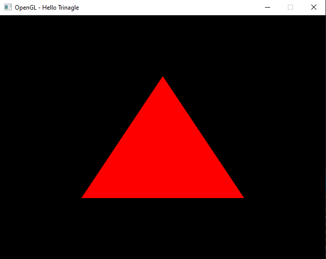
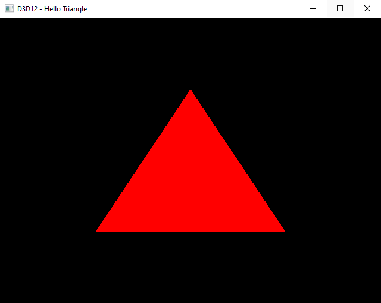

# SDL-Samples
A collection of samples I've created for myself in pursuit of learning SDL2.0

# 01-Window
Creates a basic SDL window

# 02-OGL-Triangle
Presents how to initialise and create a window with an OpenGL context

# 03-D3D12-Triangle
Presents how to initialise and create a window with an DirectX12 context

